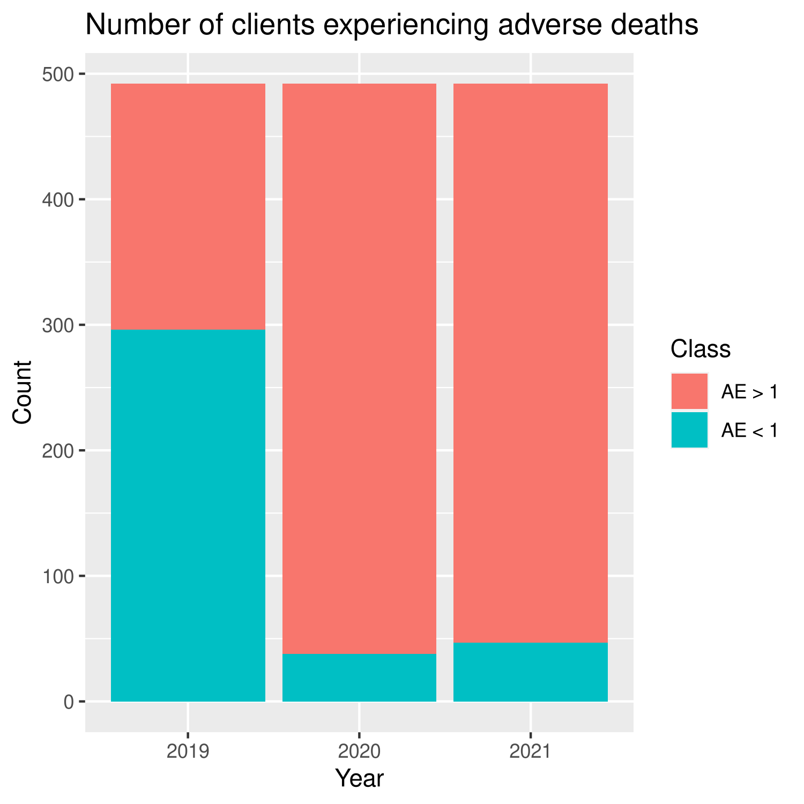
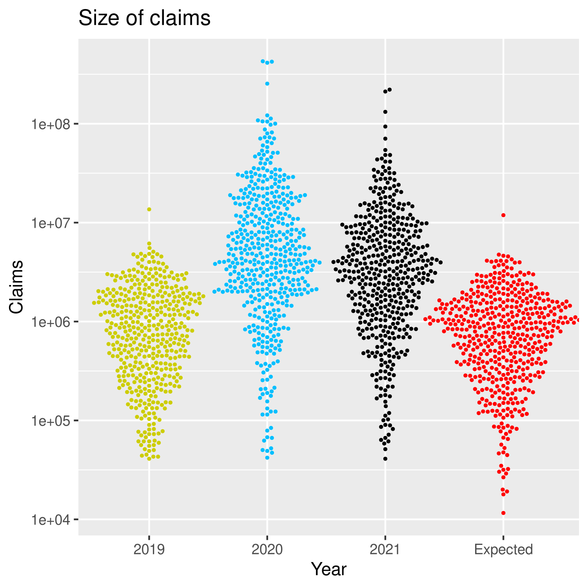
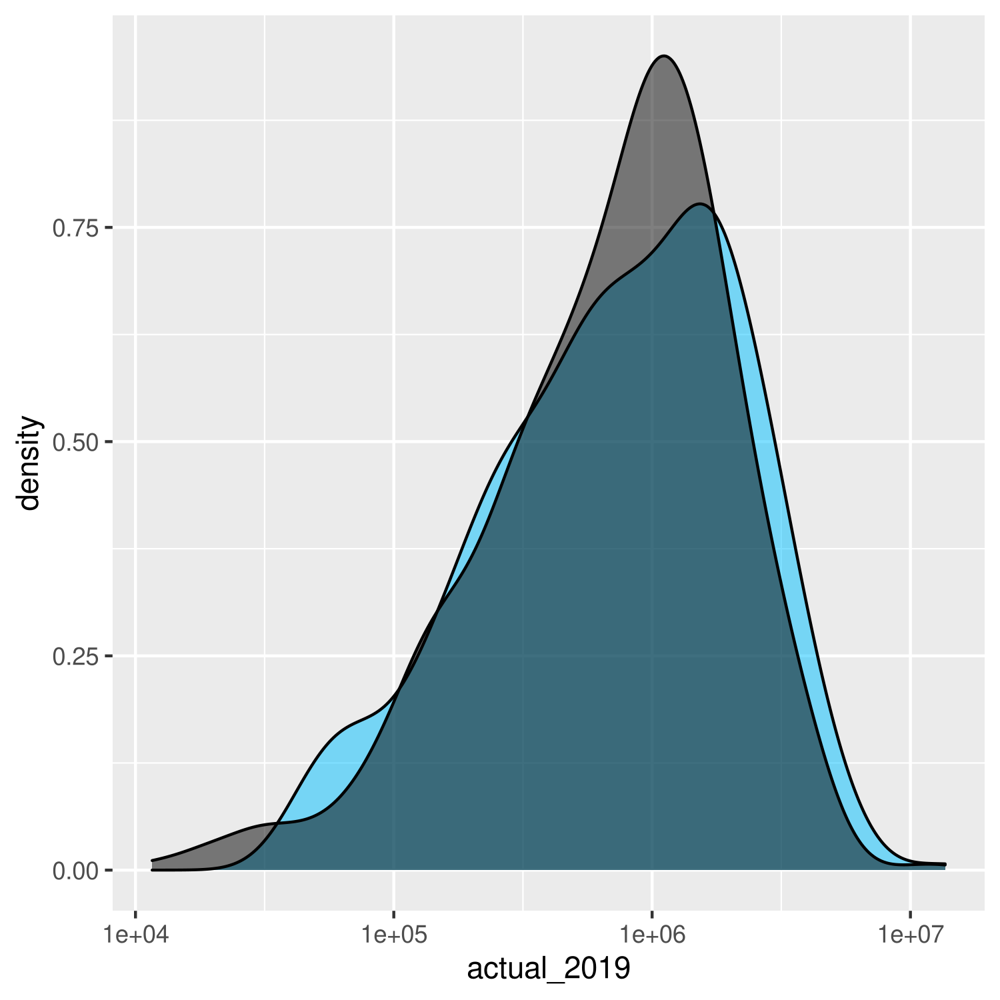
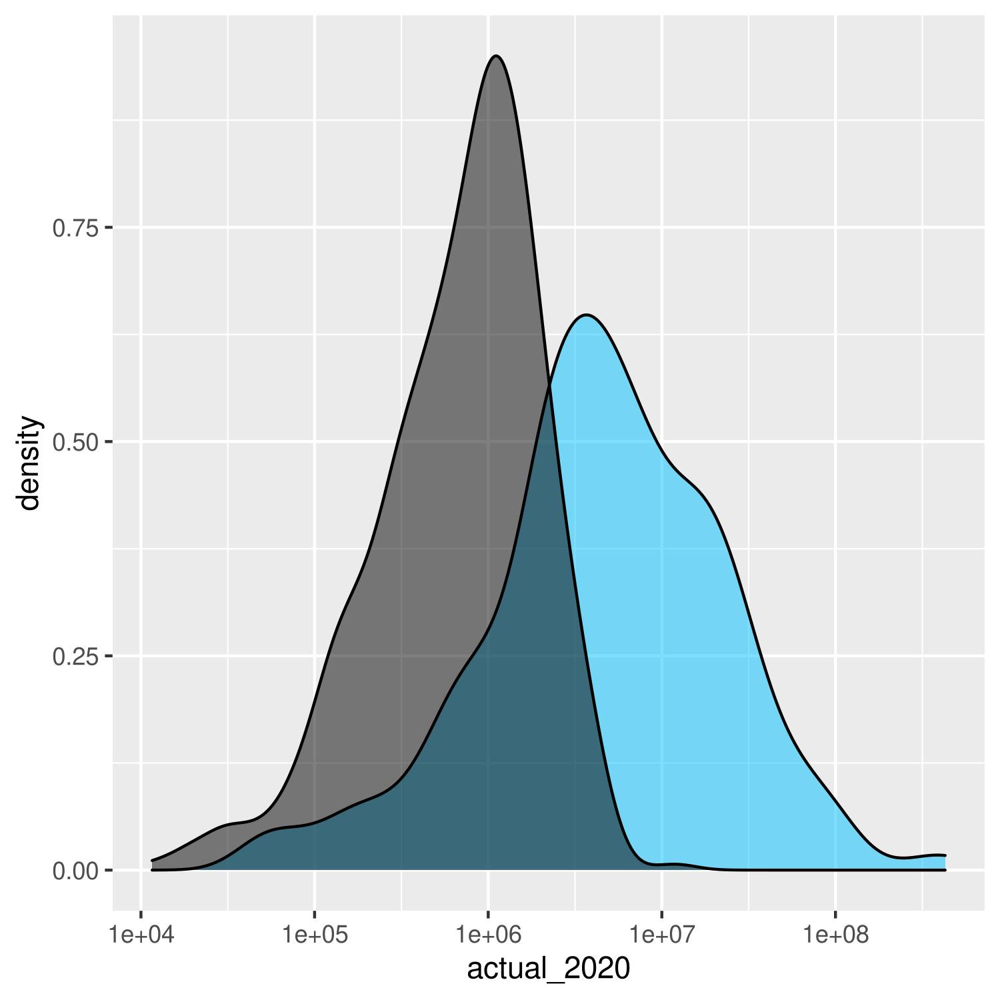
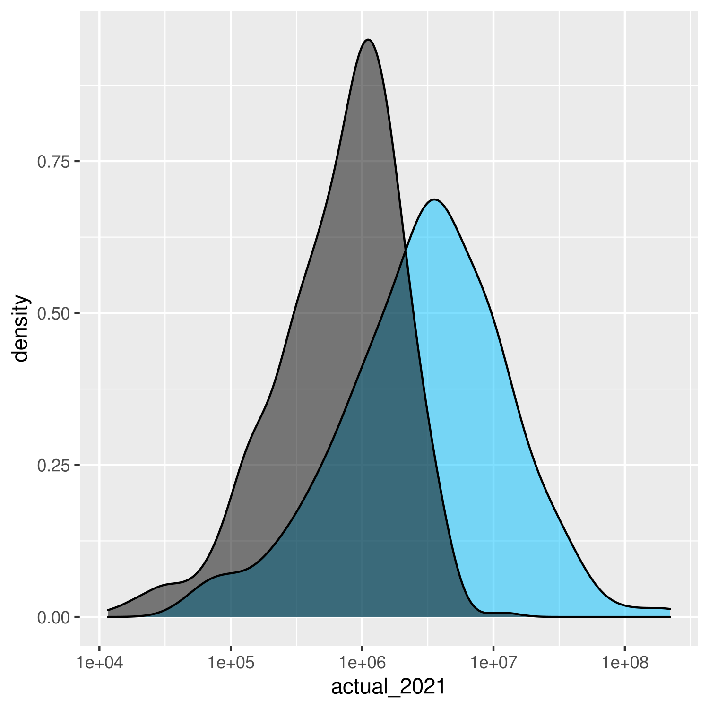
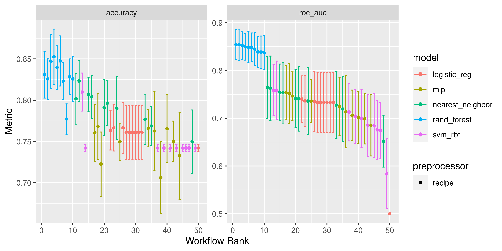
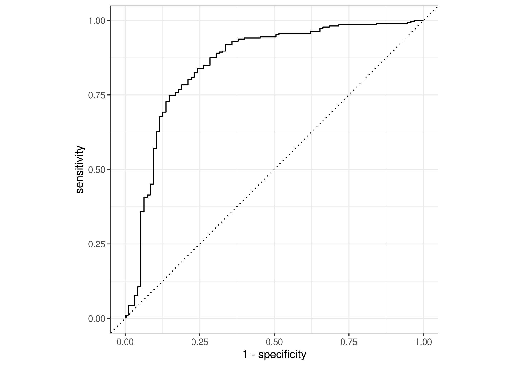
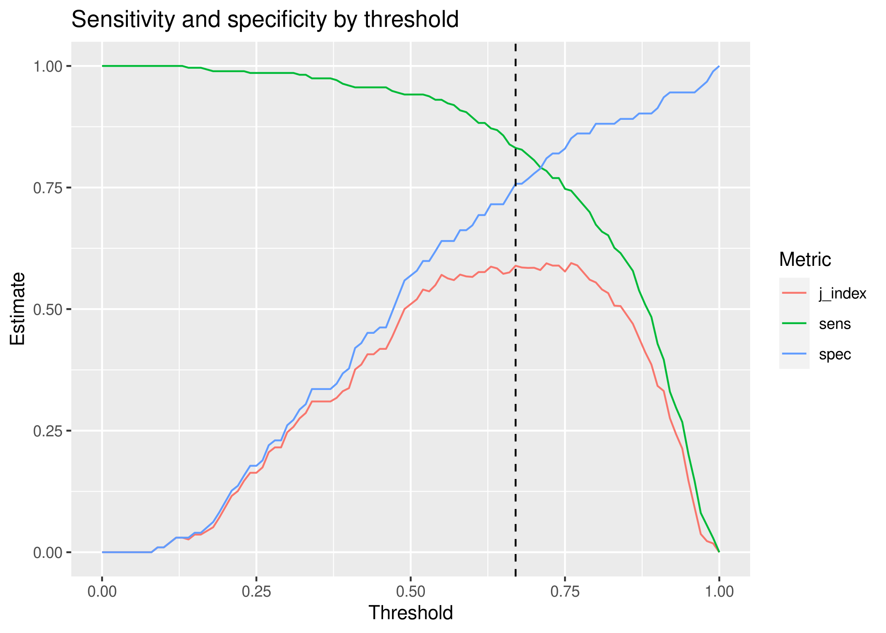
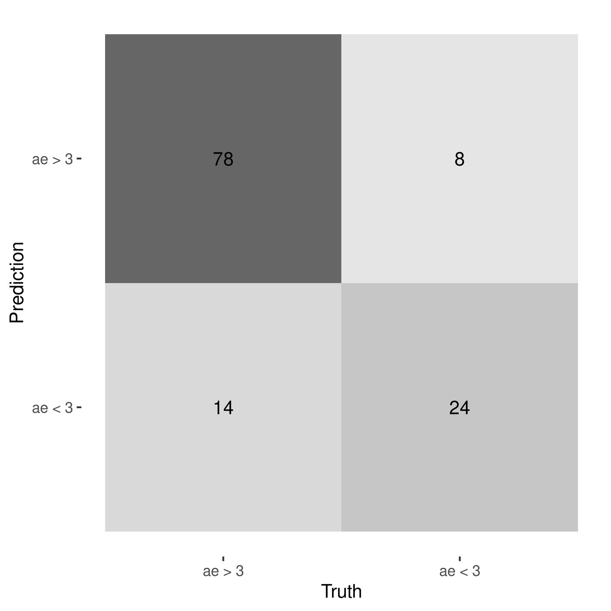

# Presentation 2 script

## Data loading
No need to talk about this.
Please download the latest version of `data/simulation_data/all_persons.feather` from Google Drive.

```r
library(tidyverse)
library(tidymodels)
library(probably)
library(themis)
library(feather)
library(magrittr)
library(skimr)
library(vip)
library(ggbeeswarm)
library(finetune)
per <- read_feather("data/simulation_data/all_persons.feather")

clients <-
  per %>%
  group_by(client) %>%
  summarize(
    zip3 = first(zip3),
    size = n(),
    volume = sum(FaceAmt),
    avg_qx = mean(qx),
    avg_age = mean(Age),
    per_male = sum(Sex == "Male") / size,
    per_blue_collar = sum(collar == "blue") / size,
    expected = sum(qx * FaceAmt),
    actual_2021 = sum(FaceAmt[year == 2021], na.rm = TRUE),
    ae_2021 = actual_2021 / (expected / 2),
    actual_2020 = sum(FaceAmt[year == 2020], na.rm = TRUE),
    ae_2020 = actual_2020 / expected,
    actual_2019 = sum(FaceAmt[year == 2019], na.rm = TRUE),
    ae_2019 = actual_2019 / expected,
    adverse = as_factor(if_else(ae_2020 > 3, "ae > 3", "ae < 3"))
  ) %>%
  relocate(adverse, ae_2020, .after = zip3) %>%
  mutate(adverse = fct_relevel(adverse, c("ae > 3", "ae < 3")))


zip_data <-
  read_feather("data/data.feather") %>%
  mutate(
    density = POP / AREALAND,
    AREALAND = NULL,
    AREA = NULL,
    HU = NULL,
    vaccinated = NULL,
    per_lib = NULL,
    per_green = NULL,
    per_other = NULL,
    per_rep = NULL,
    unempl_2020 = NULL,
    deaths_covid = NULL,
    deaths_all = NULL
  ) %>%
  rename(
    unemp = unempl_2019,
    hes_uns = hes_unsure,
    str_hes = strong_hes,
    income = Median_Household_Income_2019
  )


clients %<>%
  inner_join(zip_data, by = "zip3") %>%
  drop_na()
```

We now have our full dataset. Behold!

```r
skim(clients)
```


Table: Data summary

|                         |        |
|:------------------------|:-------|
|Name                     |clients |
|Number of rows           |492     |
|Number of columns        |33      |
|_______________________  |        |
|Column type frequency:   |        |
|character                |2       |
|factor                   |1       |
|numeric                  |30      |
|________________________ |        |
|Group variables          |None    |


**Variable type: character**

|skim_variable | n_missing| complete_rate| min| max| empty| n_unique| whitespace|
|:-------------|---------:|-------------:|---:|---:|-----:|--------:|----------:|
|client        |         0|             1|   1|   3|     0|      492|          0|
|zip3          |         0|             1|   3|   3|     0|      222|          0|


**Variable type: factor**

|skim_variable | n_missing| complete_rate|ordered | n_unique|top_counts         |
|:-------------|---------:|-------------:|:-------|--------:|:------------------|
|adverse       |         0|             1|FALSE   |        2|ae : 365, ae : 127 |


**Variable type: numeric**

|skim_variable   | n_missing| complete_rate|         mean|           sd|         p0|          p25|          p50|          p75|         p100|hist  |
|:---------------|---------:|-------------:|------------:|------------:|----------:|------------:|------------:|------------:|------------:|:-----|
|ae_2020         |         0|             1|        14.96|        27.61|       0.00|         2.90|         6.34|        13.60| 2.299400e+02|▇▁▁▁▁ |
|size            |         0|             1|      2765.07|      2338.76|      50.00|      1013.00|      2113.50|      3968.25| 1.426900e+04|▇▃▁▁▁ |
|volume          |         0|             1| 430147481.25| 402860299.13| 6235075.00| 150858731.25| 334982812.50| 587328075.00| 4.349571e+09|▇▁▁▁▁ |
|avg_qx          |         0|             1|         0.00|         0.00|       0.00|         0.00|         0.00|         0.00| 0.000000e+00|▂▇▇▂▁ |
|avg_age         |         0|             1|        41.52|         2.05|      37.68|        40.10|        41.05|        42.47| 4.865000e+01|▃▇▃▁▁ |
|per_male        |         0|             1|         0.57|         0.10|       0.22|         0.50|         0.56|         0.64| 8.900000e-01|▁▃▇▅▁ |
|per_blue_collar |         0|             1|         1.00|         0.00|       1.00|         1.00|         1.00|         1.00| 1.000000e+00|▁▁▇▁▁ |
|expected        |         0|             1|   1064558.77|   1040313.34|   11604.50|    346322.94|    827888.67|   1427761.03| 1.189533e+07|▇▁▁▁▁ |
|actual_2021     |         0|             1|   7303879.17|  17390932.42|       0.00|   1018337.50|   3021187.50|   7500950.00| 2.211325e+08|▇▁▁▁▁ |
|ae_2021         |         0|             1|        14.17|        19.13|       0.00|         4.24|         7.91|        15.17| 1.457200e+02|▇▁▁▁▁ |
|actual_2020     |         0|             1|  14300179.17|  38311222.22|       0.00|   1933918.75|   4316787.50|  13739356.25| 4.280830e+08|▇▁▁▁▁ |
|actual_2019     |         0|             1|   1087581.25|   1247699.93|       0.00|    224218.75|    674962.50|   1605662.50| 1.362532e+07|▇▁▁▁▁ |
|ae_2019         |         0|             1|         0.98|         0.81|       0.00|         0.47|         0.85|         1.31| 6.290000e+00|▇▂▁▁▁ |
|nohs            |         0|             1|        11.20|         3.75|       4.00|         8.44|        10.78|        12.90| 2.165000e+01|▂▇▅▁▂ |
|hs              |         0|             1|        23.75|         7.02|      12.10|        18.90|        23.10|        27.50| 4.680000e+01|▅▇▅▂▁ |
|college         |         0|             1|        28.45|         4.83|      13.50|        25.60|        28.58|        31.56| 3.980000e+01|▁▃▇▆▂ |
|bachelor        |         0|             1|        36.62|        10.42|      14.07|        30.00|        35.36|        43.04| 6.130000e+01|▂▇▇▆▂ |
|R_birth         |         0|             1|        11.31|         1.17|       8.30|        10.50|        11.20|        12.00| 1.551000e+01|▁▇▇▂▁ |
|R_death         |         0|             1|         8.13|         1.87|       4.69|         6.80|         7.59|         9.13| 1.401000e+01|▃▇▃▂▁ |
|unemp           |         0|             1|         3.43|         0.87|       2.10|         2.80|         3.31|         3.89| 6.690000e+00|▆▇▃▁▁ |
|poverty         |         0|             1|        10.98|         3.28|       5.04|         8.73|        10.56|        13.30| 2.577000e+01|▆▇▃▁▁ |
|per_dem         |         0|             1|         0.57|         0.16|       0.16|         0.46|         0.58|         0.71| 8.600000e-01|▂▅▇▇▆ |
|hes             |         0|             1|         0.09|         0.04|       0.04|         0.06|         0.07|         0.11| 2.600000e-01|▇▃▂▁▁ |
|hes_uns         |         0|             1|         0.13|         0.05|       0.06|         0.10|         0.12|         0.17| 3.100000e-01|▇▆▅▁▁ |
|str_hes         |         0|             1|         0.05|         0.03|       0.02|         0.03|         0.04|         0.07| 1.800000e-01|▇▅▂▁▁ |
|svi             |         0|             1|         0.46|         0.19|       0.04|         0.33|         0.44|         0.59| 9.200000e-01|▂▆▇▃▂ |
|cvac            |         0|             1|         0.42|         0.21|       0.02|         0.24|         0.41|         0.53| 9.400000e-01|▃▅▇▃▁ |
|income          |         0|             1|     79056.02|     23916.16|   38621.49|     62130.76|     73570.69|     85137.47| 1.352340e+05|▃▇▅▂▂ |
|POP             |         0|             1|    785665.87|    558640.36|   33245.00|    346048.00|    771280.00|    974040.00| 2.906700e+06|▇▇▂▁▁ |
|density         |         0|             1|         0.00|         0.00|       0.00|         0.00|         0.00|         0.00| 3.000000e-02|▇▁▁▁▁ |

## How many were actually adverse?
We count how many have AE > 1 in each year

```r
clients %>%
  transmute(
    `2019` = ae_2019 > 1,
    `2020` = ae_2020 > 1,
    `2021` = ae_2021 > 1) %>%
  pivot_longer(`2019`:`2021`, names_to = "year", values_to = "adverse") %>%
  mutate(adverse = fct_rev(fct_recode(factor(adverse), `AE > 1` = "TRUE", `AE < 1` = "FALSE"))) %>%
  ggplot(aes(x = year, fill = adverse)) + geom_bar() +
  labs( x = "Year", y = "Count", fill = "Class", title = "Number of clients experiencing adverse deaths")
```



```r
  # scale_fill_manual(values = c("yellow2", "deepskyblue"))
```

Changes in actual claims from 2019 to 2021. Here each point is a company. Note the y-axis is logarithmic!!!

```r
set.seed(92929292)
clients %>%
  select(expected, actual_2019, actual_2020, actual_2021) %>%
  rename(actual_Expected = expected) %>%
  pivot_longer(everything(), names_to = "Year", values_to = "Claims") %>%
  mutate(Year = str_sub(Year, 8)) %>%
  filter(Claims > 0) %>%
  ggplot(aes(Year, Claims, color = Year)) + scale_y_log10() + geom_beeswarm(size = 0.5, priority = "random") +
  guides(color = "none") + labs(title = "Size of claims") +
  scale_color_manual(values = c("yellow3", "deepskyblue", "black", "red"))
```




```r
ggplot(clients) +
  geom_density(aes(x = actual_2019), fill = "deepskyblue", alpha = 0.5) +
  geom_density(aes(x = expected), fill = "black", alpha = 0.5) +
  scale_x_log10()
```

```
## Warning: Transformation introduced infinite values in continuous x-axis
```

```
## Warning: Removed 47 rows containing non-finite values (stat_density).
```



```r
  #geom_point(data=data, aes(x=client, y=expected), colour="deepskyblue")+
  #geom_point(data=data, aes(x=client, y=actual2021), color="black") +
 # scale_y_continuous(name="Actual vs Expected Claims in 2019")
```

```r
ggplot(clients) +
  geom_density(aes(x = actual_2020), fill = "deepskyblue", alpha = 0.5) +
  geom_density(aes(x = expected), fill = "black", alpha = 0.5) +
  scale_x_log10()
```

```
## Warning: Transformation introduced infinite values in continuous x-axis
```

```
## Warning: Removed 7 rows containing non-finite values (stat_density).
```



```r
ggplot(clients) +
  geom_density(aes(x = actual_2021), fill = "deepskyblue", alpha = 0.5) +
  geom_density(aes(x = expected), fill = "black", alpha = 0.5) +
  scale_x_log10()
```

```
## Warning: Transformation introduced infinite values in continuous x-axis
```

```
## Warning: Removed 23 rows containing non-finite values (stat_density).
```


##Trying many models with and without 2019 AE as a predictor


```r
clients <-
  clients %>%
  select(
         -ae_2020, -ae_2021, -actual_2020, -actual_2019, -actual_2021,
         -hes, -hes_uns, -str_hes)


with2019_rec <-
  recipe(adverse ~ ., data = clients) %>%
  update_role(zip3, client, new_role = "ID") %>%
  step_zv(all_predictors()) %>%
  step_normalize(all_predictors(), -all_nominal())
no2019_rec <-
  with2019_rec %>%
  step_rm(ae_2019)

log_spec <-
  logistic_reg() %>%
  set_engine("glm") %>%
  set_mode("classification")
tuned_log_spec <-
  logistic_reg(penalty = 0.00118) %>%
  set_engine("glmnet") %>%
  set_mode("classification")
forest_spec <-
  rand_forest(trees = 1000) %>%
  set_mode("classification") %>%
  set_engine("ranger", num.threads = 8, importance = "impurity", seed = 123)
tuned_forest_spec <-
  rand_forest(trees = 1000, mtry = 12, min_n = 21) %>%
  set_mode("classification") %>%
  set_engine("ranger", num.threads = 8, importance = "impurity", seed = 123)
# Samara's models
sln_spec <-
  mlp() %>%
  set_engine("nnet") %>%
  set_mode("classification")
svm_rbf_spec <-
  svm_rbf() %>%
  set_engine("kernlab") %>%
  set_mode("classification")
svm_poly_spec <-
  svm_poly() %>%
  set_engine("kernlab") %>%
  set_mode("classification")
knn_spec <-
  nearest_neighbor() %>%
  set_engine("kknn") %>%
  set_mode("classification")

models <- list(log = log_spec,
               logtuned = tuned_log_spec,
               forest = forest_spec,
               foresttuned = tuned_forest_spec,
               neural = sln_spec,
               svmrbf = svm_rbf_spec,
               svmpoly = svm_poly_spec,
               knnspec = knn_spec)
recipes <- list("with2019ae" = with2019_rec,
                "no2019ae" = no2019_rec)
wflows <- workflow_set(recipes, models)
```

```r
set.seed(30308)
init <- initial_split(clients, strata = adverse)
set.seed(30308)
crossval <- vfold_cv(training(init), strata = adverse)
```


```r
fit_wflows <-
  wflows %>%
  workflow_map(fn = "fit_resamples",
               seed = 30332,
               resamples = crossval,
               control = control_resamples(save_pred = TRUE),
               metrics = metric_set(roc_auc, sens, accuracy),
               verbose = TRUE)
## i  1 of 16 resampling: with2019ae_log
## ✔  1 of 16 resampling: with2019ae_log (3.5s)
## i  2 of 16 resampling: with2019ae_logtuned
## ✔  2 of 16 resampling: with2019ae_logtuned (3.8s)
## i  3 of 16 resampling: with2019ae_forest
## ✔  3 of 16 resampling: with2019ae_forest (4.4s)
## i  4 of 16 resampling: with2019ae_foresttuned
## ✔  4 of 16 resampling: with2019ae_foresttuned (4.6s)
## i  5 of 16 resampling: with2019ae_neural
## ✔  5 of 16 resampling: with2019ae_neural (3.7s)
## i  6 of 16 resampling: with2019ae_svmrbf
## ✔  6 of 16 resampling: with2019ae_svmrbf (3.8s)
## i  7 of 16 resampling: with2019ae_svmpoly
## ✔  7 of 16 resampling: with2019ae_svmpoly (3.9s)
## i  8 of 16 resampling: with2019ae_knnspec
## ✔  8 of 16 resampling: with2019ae_knnspec (3.9s)
## i  9 of 16 resampling: no2019ae_log
## ✔  9 of 16 resampling: no2019ae_log (4s)
## i 10 of 16 resampling: no2019ae_logtuned
## ✔ 10 of 16 resampling: no2019ae_logtuned (4.3s)
## i 11 of 16 resampling: no2019ae_forest
## ✔ 11 of 16 resampling: no2019ae_forest (4.7s)
## i 12 of 16 resampling: no2019ae_foresttuned
## ✔ 12 of 16 resampling: no2019ae_foresttuned (5.2s)
## i 13 of 16 resampling: no2019ae_neural
## ✔ 13 of 16 resampling: no2019ae_neural (3.9s)
## i 14 of 16 resampling: no2019ae_svmrbf
## ✔ 14 of 16 resampling: no2019ae_svmrbf (4s)
## i 15 of 16 resampling: no2019ae_svmpoly
## ✔ 15 of 16 resampling: no2019ae_svmpoly (4.2s)
## i 16 of 16 resampling: no2019ae_knnspec
## ✔ 16 of 16 resampling: no2019ae_knnspec (3.8s)

fit_wflows %>%
  collect_metrics() %>%
  filter(.metric %in% c("roc_auc", "accuracy")) %>%
  separate(wflow_id, into = c("rec", "mod"), sep = "_", remove = FALSE) %>%
  ggplot(aes(x = rec, y = mean, color = mod, group = mod)) +
  geom_point() + geom_line() + facet_wrap(~ factor(.metric)) +
  labs(color = "Model", x = NULL, y = "Value", title = "Performance of models with/without 2019 data")
```


## Trying many models with many tuning parameters


```r
tune_log_spec <-
  logistic_reg(penalty = tune()) %>%
  set_engine("glmnet") %>%
  set_mode("classification")
tune_forest_spec <-
  rand_forest(trees = 1000, mtry = tune(), min_n = tune()) %>%
  set_mode("classification") %>%
  set_engine("ranger", num.threads = 8, importance = "impurity", seed = 123)
# Samara's models
tune_sln_spec <-
  mlp(hidden_units = tune(), penalty = tune(), epochs = tune()) %>%
  set_engine("nnet") %>%
  set_mode("classification")
tune_svm_rbf_spec <-
  svm_rbf(cost = tune(), rbf_sigma = tune(), margin = tune()) %>%
  set_engine("kernlab") %>%
  set_mode("classification")
# tune_svm_poly_spec <-
#   svm_poly() %>%
#   set_engine("kernlab") %>%
#   set_mode("classification")
tune_knn_spec <-
  nearest_neighbor(neighbors = tune(), dist_power = tune()) %>%
  set_engine("kknn") %>%
  set_mode("classification")

models <- list(log = tune_log_spec,
               forest = tune_forest_spec,
               sln = tune_sln_spec,
               svm = tune_svm_rbf_spec,
               knn = tune_knn_spec)
recipes <- list(no2019_rec)
wflows <- workflow_set(recipes, models)
```


```r
# make a bigger grid!
# or use something like finetune!
results <-
  wflows %>%
  workflow_map(resamples = crossval,
               grid = 10,
               metrics = metric_set(roc_auc, accuracy),
               control = control_grid(save_pred = TRUE),
               seed = 828282,
               verbose = TRUE)
## i 1 of 5 tuning:     recipe_log
## ✔ 1 of 5 tuning:     recipe_log (4.7s)
## i 2 of 5 tuning:     recipe_forest
## i Creating pre-processing data to finalize unknown parameter: mtry
## ✔ 2 of 5 tuning:     recipe_forest (42.3s)
## i 3 of 5 tuning:     recipe_sln
## ✔ 3 of 5 tuning:     recipe_sln (39.1s)
## i 4 of 5 tuning:     recipe_svm
## ✔ 4 of 5 tuning:     recipe_svm (40.3s)
## i 5 of 5 tuning:     recipe_knn
## ✔ 5 of 5 tuning:     recipe_knn (35s)
```

```r
autoplot(results)
```



## Tuning a forest

We don't need to normalize the predictors

```r
forest_spec <-
  rand_forest(mtry = tune(), min_n = tune(), trees = 1000) %>%
  set_mode("classification") %>%
  set_engine("ranger", num.threads = 8, importance = "impurity", seed = 654)

forest_rec <-
  recipe(adverse ~ ., data = clients) %>%
  step_rm(ae_2019) %>%
  update_role(client, zip3, new_role = "ID") %>%
  step_zv(all_predictors())

forest_wflow <-
  workflow() %>%
  add_model(forest_spec) %>%
  add_recipe(no2019_rec)

forest_params <-
  forest_wflow %>%
  parameters() %>%
  update(mtry = mtry(c(1, 20)))

forest_grid <-
  grid_regular(forest_params, levels = 10)
```

```r
forest_tune <-
  forest_wflow %>%
  tune_grid(
      resamples = crossval,
      grid = forest_grid,
      metrics = metric_set(roc_auc, accuracy),
      control = control_grid(verbose = FALSE)
  )
```

```r
forest_tune %>%
  show_best(metric = "roc_auc", n = 10)
```

```
## # A tibble: 10 × 8
##     mtry min_n .metric .estimator  mean     n std_err .config             
##    <int> <int> <chr>   <chr>      <dbl> <int>   <dbl> <chr>               
##  1     9    14 roc_auc binary     0.857    10  0.0182 Preprocessor1_Model…
##  2     7     6 roc_auc binary     0.857    10  0.0166 Preprocessor1_Model…
##  3     5     6 roc_auc binary     0.856    10  0.0168 Preprocessor1_Model…
##  4     5    10 roc_auc binary     0.855    10  0.0179 Preprocessor1_Model…
##  5     3     6 roc_auc binary     0.855    10  0.0177 Preprocessor1_Model…
##  6     3    10 roc_auc binary     0.855    10  0.0170 Preprocessor1_Model…
##  7     3    14 roc_auc binary     0.855    10  0.0172 Preprocessor1_Model…
##  8     5     2 roc_auc binary     0.855    10  0.0177 Preprocessor1_Model…
##  9     7    18 roc_auc binary     0.855    10  0.0199 Preprocessor1_Model…
## 10     9    10 roc_auc binary     0.855    10  0.0180 Preprocessor1_Model…
```

```r
autoplot(forest_tune)
```


## These are our optimal parameters


```r
best_params <- list(mtry = 5, min_n = 6)
```

## Threshold the forest

use library `probably`


```r
forest_resamples <-
  forest_wflow %>%
  finalize_workflow(best_params) %>%
  fit_resamples(
      resamples = crossval,
      control = control_resamples(save_pred = TRUE)
  )

forest_resamples %>%
  select(.predictions) %>%
  unnest(.predictions) %>%
  roc_curve(adverse, `.pred_ae > 3`) %>%
  autoplot()
```



```r
forest_resamples <-
  forest_resamples %>%
  rowwise() %>%
  mutate(thr_perf = list(threshold_perf(.predictions, adverse, `.pred_ae > 3`, thresholds = seq(0.0, 1, by = 0.01))))


forest_resamples %>%
  select(thr_perf, id) %>%
  unnest(thr_perf) %>%
  group_by(.threshold, .metric) %>%
  summarize(estimate = mean(.estimate)) %>%
  filter(.metric != "distance") %>%
  ggplot(aes(x = .threshold, y = estimate, color = .metric)) + geom_line() +
  geom_vline(xintercept = 0.67, linetype = "dashed") +
  labs(x = "Estimate", y = "Threshold", color = "Metric", title = "Sensitivity and specificity by threshold")
```

```
## `summarise()` has grouped output by '.threshold'. You can override using the `.groups` argument.
```



We select 0.67 as our final threshold

```r
my_threshold <- 0.67
```


## This is our final model !!!

```r
final_fit <-
  forest_wflow %>%
  finalize_workflow(best_params) %>%
  last_fit(init)

trained_wflow <-
  final_fit %>%
  extract_workflow()

trained_recipe <-
  trained_wflow %>%
  extract_recipe(estimated = TRUE)
```


## Apply chosen threshold and compute metrics
Use `probably` to apply threshold.
Conf. matrix, accuracy, sens, spec, whatever you like


```r
thresholded_predictions <-
  final_fit %>%
  collect_predictions() %>%
  select(-.pred_class) %>%
  mutate(class_pred = 
            make_two_class_pred(
                  `.pred_ae > 3`,
                  levels = levels(clients$adverse),
                  threshold = my_threshold))

confusion_matrix <-
  thresholded_predictions %>%
  conf_mat(adverse, class_pred)

confusion_matrix %>%
  autoplot(type = "heatmap")
```



```r
confusion_matrix %>% summary()
```

```
## # A tibble: 13 × 3
##    .metric              .estimator .estimate
##    <chr>                <chr>          <dbl>
##  1 accuracy             binary         0.823
##  2 kap                  binary         0.563
##  3 sens                 binary         0.848
##  4 spec                 binary         0.75 
##  5 ppv                  binary         0.907
##  6 npv                  binary         0.632
##  7 mcc                  binary         0.567
##  8 j_index              binary         0.598
##  9 bal_accuracy         binary         0.799
## 10 detection_prevalence binary         0.694
## 11 precision            binary         0.907
## 12 recall               binary         0.848
## 13 f_meas               binary         0.876
```

#SHAP value is not done yet. It is done if we can take the whole clients set (not dividing between train and test). But if we want to use it on test only, needs more work. (see pictures on slack for the whole client set). 


```r
fulltest <- testing(init)
fulltrain <- training(init)
```


```r
library(DALEX)
fit_parsnip <- trained_wflow %>% extract_fit_parsnip
train <- trained_recipe %>% bake(training(init))
test <- trained_recipe %>% bake(testing(init))
ex <-
  explain(
    model = fit_parsnip,
    data = train)

ex %>%
  predict_parts(train %>% slice(343)) %>%
  plot()

fit_parsnip %>% predict(train %>% slice(343), type = "prob")
```


```r
shap <- predict_parts(explainer = ex, 
                      new_observation = train%>%slice(343), 
                                 type = "shap",
                                  B = 25)
```

```
## Error in "explainer" %in% class(explainer): object 'ex' not found
```


```r
plot(shap,show_boxplots = FALSE)
```

```
## Error in h(simpleError(msg, call)): error in evaluating the argument 'x' in selecting a method for function 'plot': object 'shap' not found
```


```r
library(treeshap)
```


```r
clients$adverse <- ifelse(clients$adverse == "ae > 3", 1, 0)
```


```r
model <- final_fit %>%
  extract_fit_engine()
```


```r
test <- testing(init)
test$adverse <- ifelse(test$adverse == "ae > 3", 1, 0)
test
```


```r
final_pred
test
test_pred <- merge((final_pred, test), 
```


```r
model_unified <- ranger.unify(model, )
```


#autoplot(cm, type = "heatmap")


