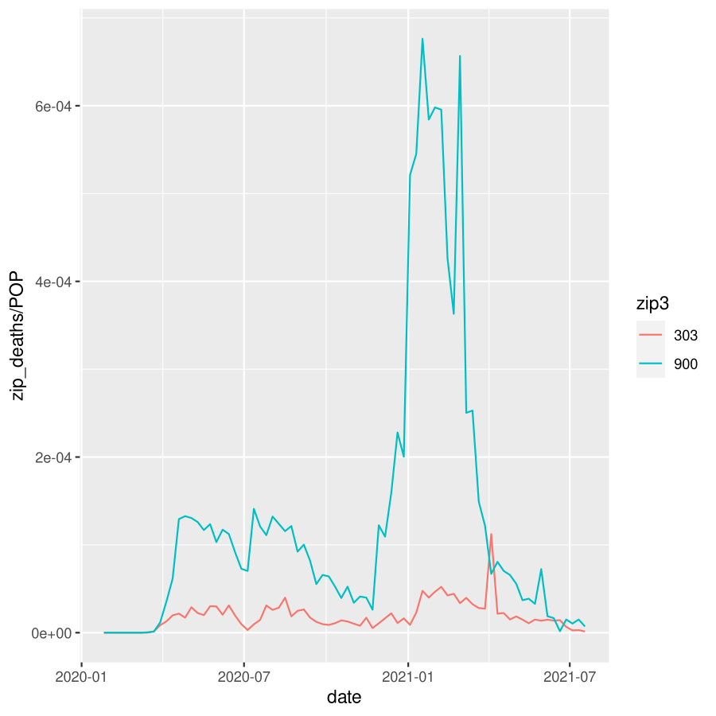
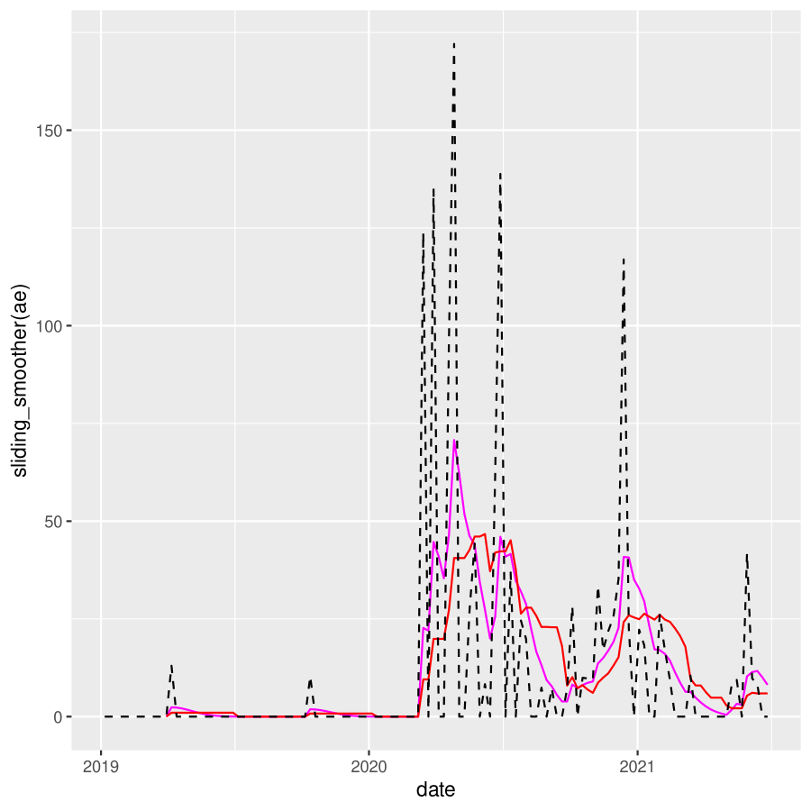
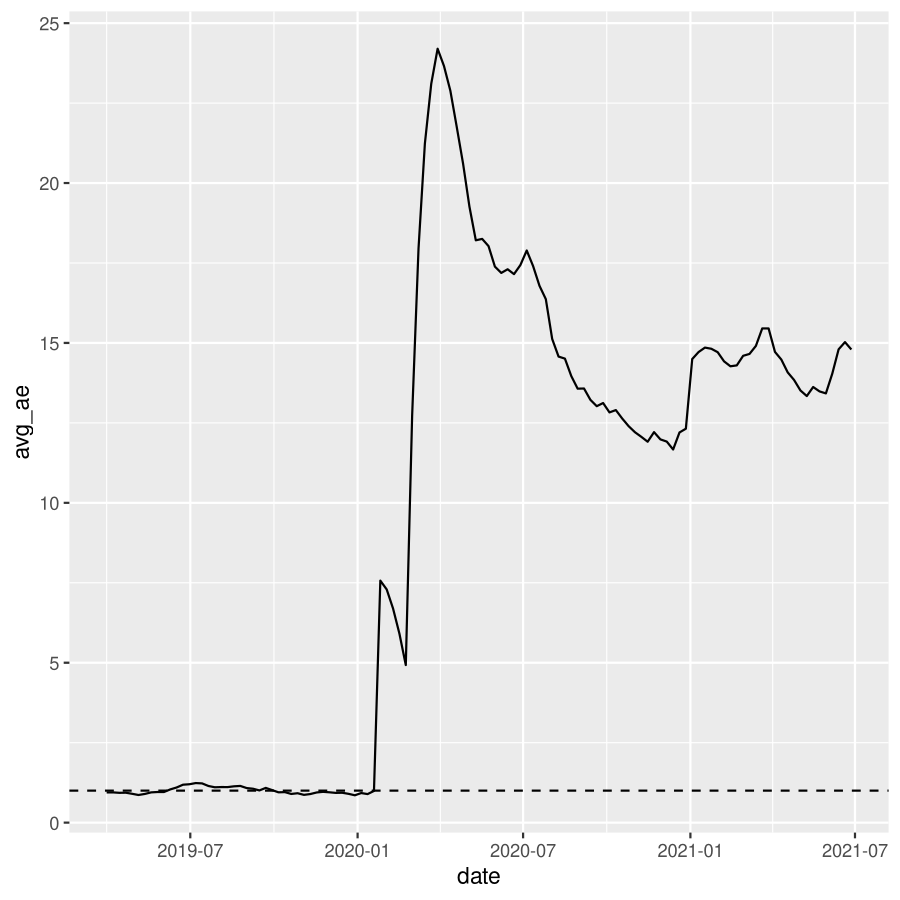
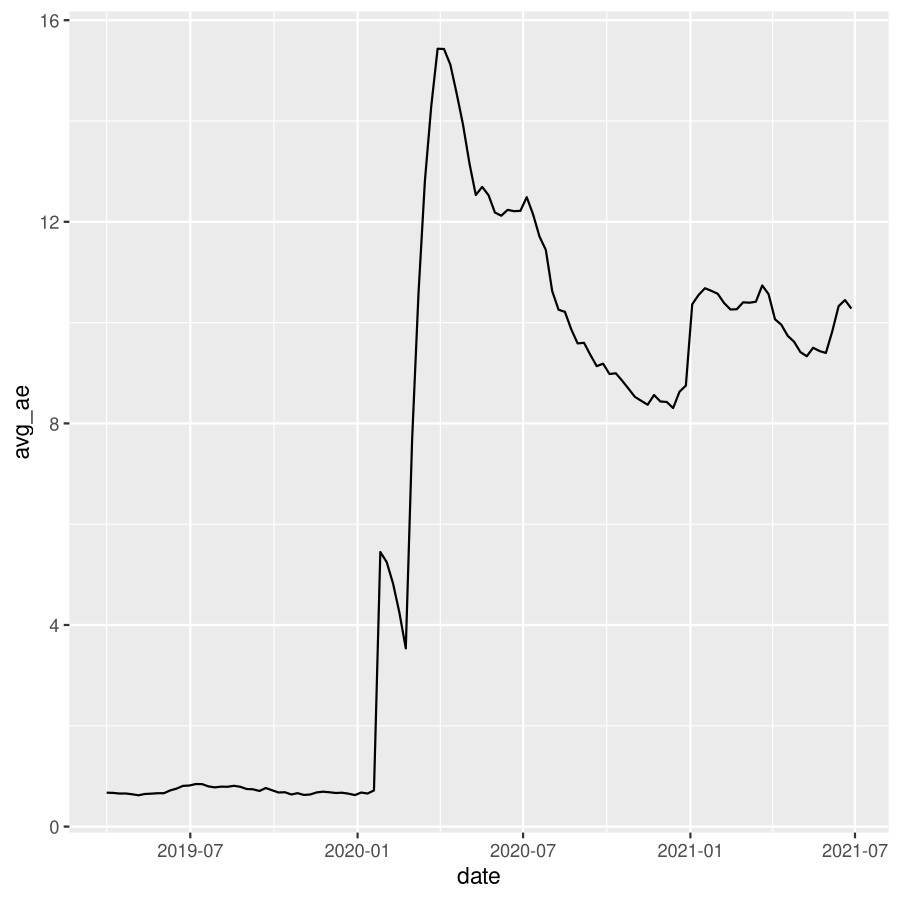
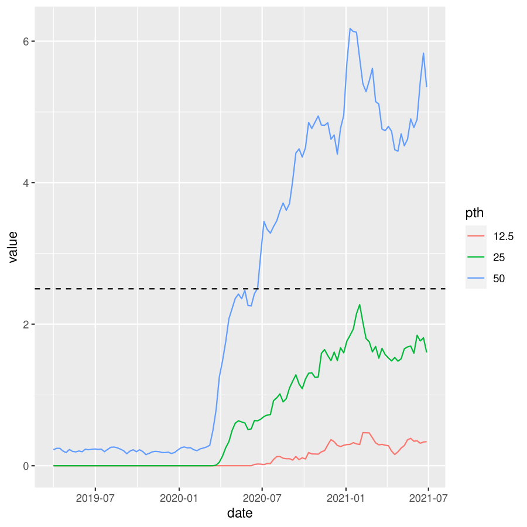
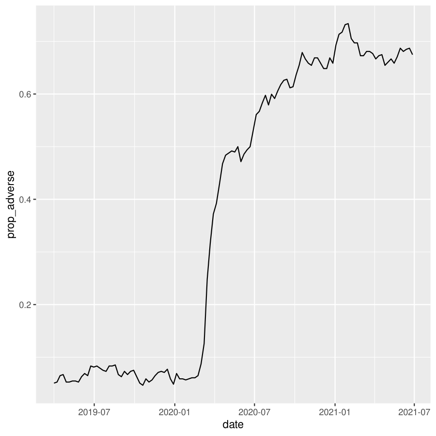
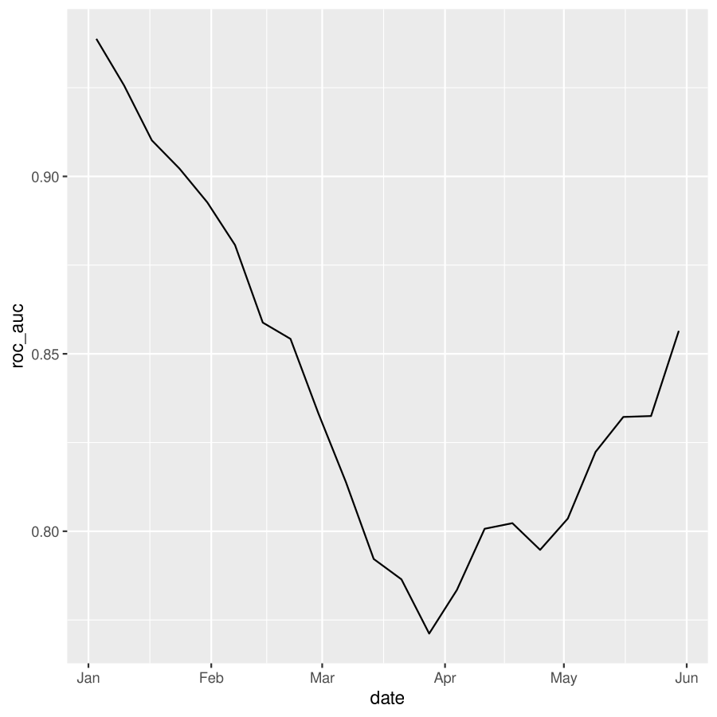
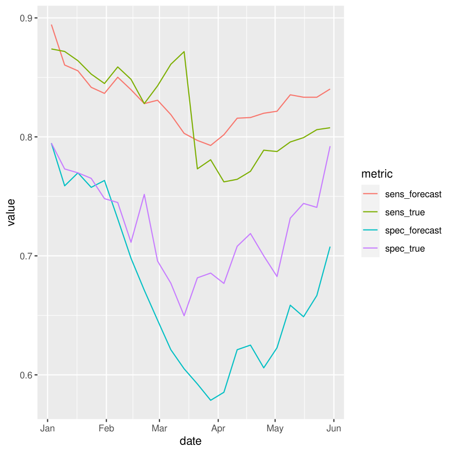
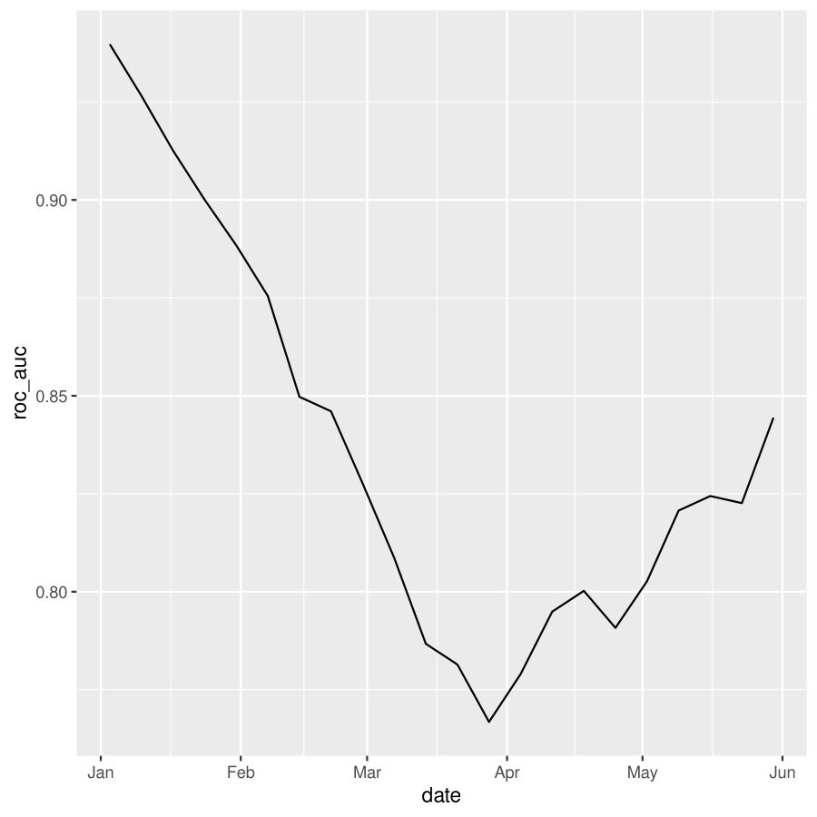
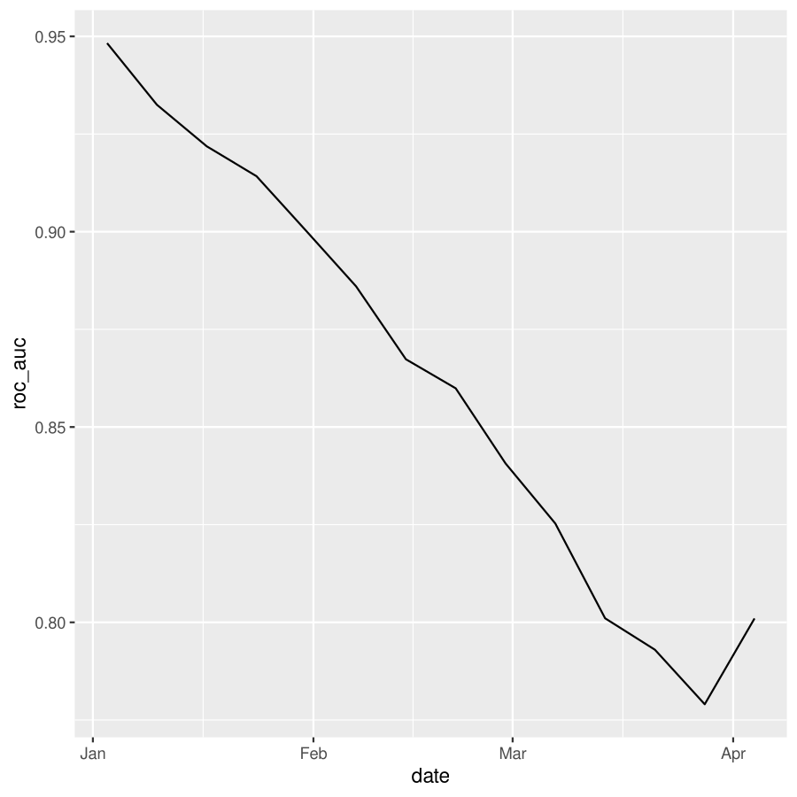

# Time-based models
Here we will look at what happens when time-dependent data is added. At the moment, we only use deaths per day per zipcode

## Data wrangling
This is going to be mostly the same as `baseline_models.Rmd`. Refer to that file for more details.
Note that here we're not extracting the AEs.

```r
library(tidyverse)
library(tidymodels)
library(feather)
# library(arrow)
library(magrittr)
library(skimr)
library(lubridate)
library(timetk)
library(modeltime)
library(glue)
library(slider)
per <- read_feather("data/simulation_data/all_persons.feather")

clients <-
  per %>%
  group_by(client) %>%
  summarize(
    zip3 = first(zip3),
    size = n(),
    volume = sum(FaceAmt),
    avg_qx = mean(qx),
    avg_age = mean(Age),
    per_male = sum(Sex == "Male") / size,
    per_blue_collar = sum(collar == "blue") / size,
    expected = sum(qx * FaceAmt)
  )

zip_data <-
  read_feather("data/data.feather") %>%
  mutate(
    density = POP / AREALAND,
    AREALAND = NULL,
    AREA = NULL,
    HU = NULL,
    vaccinated = NULL,
    per_lib = NULL,
    per_green = NULL,
    per_other = NULL,
    per_rep = NULL,
    unempl_2020 = NULL,
    deaths_covid = NULL,
    deaths_all = NULL
  ) %>%
  rename(
    unemp = unempl_2019,
    hes_uns = hes_unsure,
    str_hes = strong_hes,
    income = Median_Household_Income_2019
  )

clients %<>%
  inner_join(zip_data, by = "zip3") %>%
  drop_na()
```

Now we have to be careful...

We take daily covid deaths and make them weekly.
Also, look at weekly deaths instead of deaths to date

```r
deaths <-
  read_feather("data/deaths_zip3.feather") %>%
  mutate(date = ceiling_date(date, unit = "week")) %>%
  group_by(zip3, date) %>%
  summarize(totdeaths = max(deaths)) %>%
  mutate(zip_deaths = totdeaths - lag(totdeaths, default = 0)) %>%
  select(-totdeaths) %>%
  ungroup()
```

```
## `summarise()` has grouped output by 'zip3'. You can override using the `.groups` argument.
```

Let's see what it looks like in Atlanta and LA. We normalize by population.

```r
deaths %>%
  left_join(zip_data, by = "zip3") %>%
  filter(zip3 %in% c("303", "900")) %>%
  ggplot(aes(x = date, color = zip3)) +
  geom_line(aes(y = zip_deaths / POP))
```



One thing to note, there is no death data for zipcodes 202, 204, 753, 772 (which is fine, since there is no zip_data for those either).

Next we look at the deaths only

```r
per %<>%
  drop_na() %>%
  select(-month)
```

2019 didn't have 53 weeks, so the deaths on week 53 in 2019 will be changed to death in week 1 of 2020.

Now back to the 53 week business

```r
wk53 <-
  per %>%
  filter(year == 2019, week == 53) %>%
  mutate(year = 2020, week = 1)
per %<>%
  rows_update(wk53, by = c("client", "participant"))
```

The tibble `per` contains all the people that die and their deathweek. Everyone should die only once now! Let's convert the week and year into the last date of that week.


```r
per %<>%
  nest_by(week, year) %>%
  mutate(date = ceiling_date(ymd(glue("{year}-01-01")) + weeks(week - 1), unit = "week")) %>%
  ungroup() %>%
  select(-week, -year) %>%
  unnest(cols = c(data))
```


Next, we need some kind of a rolling count for AE. Looks like the package `slider` might help.
I want actual claims per week for each client.
We note that there are 4 clients that won't have any deaths

```r
no_deaths <-
  clients %>%
  anti_join(per, by = "client") %>%
  select(client) %>%
  mutate(date = ceiling_date(ymd("2019-01-01"), unit = "week"), claims = 0)
```

We compute face amount per week for each client. This number is 0 if the client has no deaths that week.

```r
weekly_claims <-
  per %>%
  group_by(date, client) %>%
  summarize(claims = sum(FaceAmt), .groups = "drop") %>%
  bind_rows(no_deaths) %>%
  complete(date, client, fill = list(claims = 0))
```

We now have 65,369 rows, which is 131 weeks * 499 clients.

Let's merge everything.

```r
weekly_data <-
  clients %>%
  left_join(weekly_claims, by = c("client")) %>%
  relocate(date) %>%
  relocate(claims, .after = zip3) %>%
  left_join(deaths, by = c("date", "zip3")) %>%
  relocate(zip_deaths, .after = claims) %>%
  mutate(zip_deaths = replace_na(zip_deaths, 0), ae = claims / (expected / 52.18))
```

We add a rolling AE number. We will smooth the actual claims number of each week by taking a weighted average of actual claims in the 13 weeks prior. The weights come from a Gaussian distribution...
The function `sliding_smoother` takes a vector and outputs a vector of smoothed values.

The below picture show what the smoother does for claims of client 7. We also show a 3 month mean AE

```r
smoother <- function(x) { weighted.mean(x, dnorm(seq(-1, 0, length.out = length(x)), sd = 0.33)) }
sliding_smoother <-
  slidify(smoother, .period = 13, .align = "right")

sliding_mean <-
  slidify(mean, .period = 13, .align = "right")


weekly_data %>%
  filter(client == 7) %>%
  ggplot(aes(x = date)) +
  # geom_line(aes(y = sliding_mean(claims)), color = "red") +
  # geom_line(aes(y = smooth_vec(claims, period = 13)), color = "blue") +
  geom_line(aes(y = sliding_smoother(ae)), color = "magenta") +
  geom_line(aes(y = sliding_mean(ae)), color = "red") +
  geom_line(aes(y = ae), linetype = 2)
```

```
## Warning: Removed 12 row(s) containing missing values (geom_path).

## Warning: Removed 12 row(s) containing missing values (geom_path).
```



We add a column called `smoothed_ae` and `smoothed_deaths`.

```r
weekly_data <-
  weekly_data %>%
  group_by(client) %>%
  mutate(smoothed_ae = sliding_smoother(ae), smoothed_deaths = sliding_smoother(zip_deaths), .before = size) %>%
  drop_na()
```

We plot the average AE for each week. This is pretty crazy...

```r
weekly_data %>%
  ungroup() %>%
  group_by(date) %>%
  summarize(avg_ae = mean(smoothed_ae), sd = sd(smoothed_ae)) %>%
  ggplot(aes(x = date, y = avg_ae)) +
  geom_line() +
  geom_hline(yintercept = 1, linetype = "dashed")
```



```r
  # geom_errorbar(aes(ymin = avg_ae - sd, ymax = avg_ae + sd))
```

Weekly normalized deaths in the zipcodes of our clients... I had hoped that this curve looked the same as the AE curve, but I guess it doesn't.

```r
weekly_data %>%
  ungroup() %>%
  group_by(date) %>%
  summarize(avg_deaths = mean(zip_deaths / POP)) %>%
  ggplot(aes(x = date, y = avg_deaths)) + geom_line()
```


Let compute the 25th percentile AE of each week. We will pick the threshold for `adverse` based on this.

```r
weekly_data %>%
  ungroup() %>%
  group_by(date) %>%
  summarize(
      `12.5` = quantile(smoothed_ae, 0.125),
      `25` = quantile(smoothed_ae, 0.25),
      `50` = quantile(smoothed_ae, 0.50)
  ) %>%
  pivot_longer(-date, names_to = "pth", values_to = "smoothed_ae") %>%
  ggplot(aes(x = date, y = smoothed_ae, color = pth)) +
  geom_line() +
  geom_hline(yintercept = 1, linetype = "dashed")
```


Maybe there is a better number to look at than smoothed ae. Let's shrink smoothed ae based on the log(Volume * average qx). This gives us some kind of a measure of client size and mortality.

```r
client_shrinkage <-
  weekly_data %>%
  summarize(dep_var = first(volume * avg_qx)) %>%
  mutate(shrinkage = rescale(log(dep_var), to = c(0.3, 1)))

ggplot(client_shrinkage, aes(x = dep_var)) + geom_density() + scale_x_log10()
```


```r
processed_data <-
  weekly_data %>%
  left_join(client_shrinkage, by = "client") %>%
  ungroup() %>%
  mutate(shrunk_ae = smoothed_ae * shrinkage, .after = smoothed_ae)

processed_data %>%
  group_by(date) %>%
  summarize(avg_ae = mean(shrunk_ae)) %>%
  ggplot(aes(date, avg_ae)) + geom_line()
```



```r
processed_data %>%
  ungroup() %>%
  group_by(date) %>%
  summarize(
      `12.5` = quantile(shrunk_ae, 0.125),
      `25` = quantile(shrunk_ae, 0.25),
      `50` = quantile(shrunk_ae, 0.50)
  ) %>%
  pivot_longer(-date, names_to = "pth", values_to = "value") %>%
  ggplot(aes(x = date, y = value, color = pth)) +
  geom_line() +
  geom_hline(yintercept = 2.5, linetype = "dashed")
```




We will choose "smoothed, shrunk 3 month AE" > 2.5 as "Adverse".

```r
processed_data <-
  processed_data %>%
  ungroup() %>%
  mutate(class = factor(if_else(shrunk_ae > 2.5, "Adverse", "Not adverse"), levels = c("Adverse", "Not adverse")), .after = shrunk_ae)
```


How many clients are adverse each week?

```r
processed_data %>%
  group_by(date) %>%
  summarize(prop_adverse = sum(class == "Adverse") / n()) %>%
  ggplot(aes(x = date, y = prop_adverse)) + geom_line()
```




# Modeling (with tidyverts)

## Case study: Jan 1st 2021

### ARIMA on zip_deaths + random forest

We will travel back in time. We will attempt to predict six months worth of "averse" variables for all clients.

```r
library(tsibble)
library(fable)

data_tsibble <-
  processed_data
  # mutate(yw = yearweek(date), .before = date, .keep = "unused")

# splits <-
#   data_tsibble %>%
#   filter(date >= "2020-03-15") %>%
#   nest_by(date) %>%
#   sliding_index(index = date,
#                 lookback = weeks(12),
#                 assess_stop = weeks(26))

# split <- splits %>% pluck(1, 3)
# train <- training(split) %>% unnest(data)
# test <- testing(split) %>% unnest(data)
train <-
  processed_data %>%
  filter(date <= "2021-01-01")

test <-
  processed_data %>%
  filter(date > "2021-01-01" & date <= "2021-06-01")
```

Here we will manually forecast future `zip_deaths` using a fully default ARIMA forecaster. Maybe we should actually preduct a smoothed version of `zip_deaths`???
We plot total deaths vs total forecasted deaths (in the zip codes of our clients). It's not great but it's something...

```r
forecast <-
  train %>%
  filter(date >= "2020-03-15") %>%
  as_tsibble(index = date, key = client) %>%
  model(arima = ARIMA(zip_deaths)) %>%
  forecast(h = "6 months")

foo <-
  forecast %>%
  index_by(date) %>%
  summarize(fc_deaths = sum(.mean))

bar <-
  test %>%
  as_tsibble(key = client, index = date) %>%
  index_by(date) %>%
  summarize(true_deaths = sum(zip_deaths))

foo %>%
  left_join(bar, by = "date") %>%
  ggplot(aes(x = date)) + geom_line(aes(y = fc_deaths), color = "red") + geom_line(aes(y = true_deaths))
```

```
## Warning: Removed 4 row(s) containing missing values (geom_path).
```


We will train a forest on all the data prior to Jan 1st 2021

```r
forest_spec <-
  rand_forest(trees = 1000) %>%
  set_engine("ranger", num.threads = 8, seed = 123456789) %>%
  set_mode("classification")

forest_recipe <-
  recipe(class ~ ., data = processed_data) %>%
  step_rm(client, zip3, claims, smoothed_ae, shrunk_ae, shrinkage, dep_var, ae, smoothed_deaths) %>%
  step_zv(all_predictors())

forest_wf <-
  workflow() %>%
  add_recipe(forest_recipe) %>%
  add_model(forest_spec)

trained_wf <-
  forest_wf %>%
  fit(train)
```

We substitute `zip_deaths` by the forecasted version of `zip_deaths` and predict.
We plot the `roc_auc` of our predictions.

```r
forecasted_test <-
  forecast %>%
  as_tibble() %>%
  select(client, date, .mean) %>%
  right_join(test, by = c("client", "date")) %>%
  select(-zip_deaths) %>%
  rename(zip_deaths = .mean)

trained_wf %>%
  predict(forecasted_test, type = "prob") %>%
  bind_cols(test) %>%
  group_by(date) %>%
  summarize(roc_auc = roc_auc_vec(class, .pred_Adverse)) %>%
  ggplot(aes(x = date, y = roc_auc)) + geom_line()
```



How well can we possibly do? Let's use the true deaths, and compare with our forecasted ones.
Doesn't look too bad. Maybe a random forest is not the best model ?

```r
test %>%
  bind_cols(predict(trained_wf, forecasted_test)) %>%
  rename(pred_forecast = .pred_class) %>%
  bind_cols(predict(trained_wf, test)) %>%
  rename(pred_true = .pred_class) %>%
  group_by(date) %>%
  summarize(sens_forecast = sens_vec(class, pred_forecast),
            spec_forecast = spec_vec(class, pred_forecast),
            sens_true = sens_vec(class, pred_true),
            spec_true = spec_vec(class, pred_true)) %>%
  pivot_longer(sens_forecast:spec_true, names_to = "metric", values_to = "value") %>%
  ggplot(aes(x = date, y = value, color = metric)) + geom_line()
```



### Change the death_zip variable

We will use a smoothed `zip_death` variable instead!

```r
forest_recipe <-
  recipe(class ~ ., data = processed_data) %>%
  step_rm(client, zip3, claims, smoothed_ae, shrunk_ae, shrinkage, dep_var, ae, zip_deaths) %>%
  step_zv(all_predictors())

forest_wf <-
  workflow() %>%
  add_recipe(forest_recipe) %>%
  add_model(forest_spec)

trained_wf <-
  forest_wf %>%
  fit(train)
```

We substitute `smoothed_deaths` by the forecasted version of `smoothed_deaths` and predict.
We plot the `roc_auc` of our predictions.

```r
forecasted_test <-
  forecast %>%
  as_tibble() %>%
  select(client, date, .mean) %>%
  right_join(test, by = c("client", "date")) %>%
  select(-smoothed_deaths) %>%
  rename(smoothed_deaths = .mean)

trained_wf %>%
  predict(forecasted_test, type = "prob") %>%
  bind_cols(test) %>%
  group_by(date) %>%
  summarize(roc_auc = roc_auc_vec(class, .pred_Adverse)) %>%
  ggplot(aes(x = date, y = roc_auc)) + geom_line()
```



Again, we compare with the true value of `smoothed_deaths`. It's much closer!!!!

```r
test %>%
  bind_cols(predict(trained_wf, forecasted_test)) %>%
  rename(pred_forecast = .pred_class) %>%
  bind_cols(predict(trained_wf, test)) %>%
  rename(pred_true = .pred_class) %>%
  group_by(date) %>%
  summarize(sens_forecast = sens_vec(class, pred_forecast),
            spec_forecast = spec_vec(class, pred_forecast),
            sens_true = sens_vec(class, pred_true),
            spec_true = spec_vec(class, pred_true)) %>%
  pivot_longer(sens_forecast:spec_true, names_to = "metric", values_to = "value") %>%
  ggplot(aes(x = date, y = value, color = metric)) + geom_line()
```


### Using IHME forecasts

We will use a more trustworthy forecast than our naive ARIMA...
This will require some data wrangling 🥴 

We start by loading state name and FIPS codes

```r
states <-
  read_delim("data/state.txt", delim = "|") %>%
  select(STATE, STATE_NAME)
```

```
## Rows: 57 Columns: 4
```

```
## ── Column specification ───────────────────────────────────────────────────
## Delimiter: "|"
## chr (4): STATE, STUSAB, STATE_NAME, STATENS
```

```
## 
## ℹ Use `spec()` to retrieve the full column specification for this data.
## ℹ Specify the column types or set `show_col_types = FALSE` to quiet this message.
```


We augment the main dataset by adding the state name

```r
zip_to_state <-
  read_csv("data/zcta_county_rel_10.txt") %>%
  select(ZCTA5, STATE) %>%
  mutate(zip3 = str_sub(ZCTA5, 1, 3), .keep = "unused") %>%
  group_by(zip3) %>%
  count(STATE, sort = TRUE) %>%
  slice_head() %>%
  ungroup() %>%
  left_join(states, by = "STATE") %>%
  select(-STATE, -n)
```

```
## Rows: 44410 Columns: 24
```

```
## ── Column specification ───────────────────────────────────────────────────
## Delimiter: ","
## chr  (4): ZCTA5, STATE, COUNTY, GEOID
## dbl (20): POPPT, HUPT, AREAPT, AREALANDPT, ZPOP, ZHU, ZAREA, ZAREALAND...
```

```
## 
## ℹ Use `spec()` to retrieve the full column specification for this data.
## ℹ Specify the column types or set `show_col_types = FALSE` to quiet this message.
```

```r
processed_data <-
  processed_data %>%
  nest_by(zip3) %>%
  left_join(zip_to_state, by = "zip3") %>%
  unnest(cols = c(data))
```

Next we read the data from IHME as of Dec 23 2020

```r
ihme <-
  read_csv("data/2020_12_23/reference_hospitalization_all_locs.csv") %>%
  rename(STATE_NAME = location_name) %>%
  semi_join(processed_data, by = "STATE_NAME") %>%
  select(STATE_NAME, date, deaths_mean) %>%
  mutate(date = ceiling_date(date, unit = "week")) %>%
  group_by(STATE_NAME, date) %>%
  summarize(ihme_deaths = sum(deaths_mean))
```

```
## Rows: 165633 Columns: 73
```

```
## ── Column specification ───────────────────────────────────────────────────
## Delimiter: ","
## chr   (8): location_name, hosp_data_type, deaths_data_type, mobility_d...
## dbl  (64): location_id, V1, allbed_mean, allbed_lower, allbed_upper, I...
## date  (1): date
```

```
## 
## ℹ Use `spec()` to retrieve the full column specification for this data.
## ℹ Specify the column types or set `show_col_types = FALSE` to quiet this message.
```

```
## `summarise()` has grouped output by 'STATE_NAME'. You can override using the `.groups` argument.
```

Add to `processed_data`

```r
processed_data <-
  processed_data %>%
  left_join(ihme, by = c("date", "STATE_NAME")) %>%
  ungroup() %>%
  mutate(ihme_deaths = replace_na(ihme_deaths, 0))
```

Now we can go back to our usual training testing thing. Note that for IHME, the last forecasted date is `2021-04-04`.

```r
train <-
  processed_data %>%
  filter(date <= "2021-01-01")

test <-
  processed_data %>%
  filter(date > "2021-01-01" & date <= "2021-04-04")
```

Now the usual workflow stuff

```r
forest_recipe <-
  recipe(class ~ ., data = processed_data) %>%
  step_rm(zip3, client, claims, zip_deaths, smoothed_ae, shrunk_ae, smoothed_deaths, ae, dep_var, shrinkage, STATE_NAME) %>%
  step_zv(all_predictors())

forest_wf <-
  workflow() %>%
  add_recipe(forest_recipe) %>%
  add_model(forest_spec)

trained_wf <-
  forest_wf %>%
  fit(train)
```

We plot the `roc_auc` of our predictions.

```r
trained_wf %>%
  predict(test, type = "prob") %>%
  bind_cols(test) %>%
  group_by(date) %>%
  summarize(roc_auc = roc_auc_vec(class, .pred_Adverse)) %>%
  ggplot(aes(x = date, y = roc_auc)) + geom_line()
```



We can look at sensitivity and specificity

```r
test %>%
  bind_cols(predict(trained_wf, test)) %>%
  group_by(date) %>%
  summarize(sens_forecast = sens_vec(class, .pred_class),
            spec_forecast = spec_vec(class, .pred_class)) %>%
  pivot_longer(sens_forecast:spec_forecast, names_to = "metric", values_to = "value") %>%
  ggplot(aes(x = date, y = value, color = metric)) + geom_line()
```


# BELOW IS ALSO BAD, WILL DELETE SOON!
## Modeling (Maybe will have to be redone.....)
We start with a random forest. Later we will compare other models...

We start with a split. We choose a training until "2020-05-31", testing 13 weeks from that date.

```r
cv_split <-
  processed_data %>%
  time_series_split(
      date_var = date,
      initial = 13,
      assess = 13,
      cumulative = TRUE,
      slice = 44)

cv_split %>%
  analysis() %>%
  summarize(max(date))
```

Define a model

```r
forest_spec <-
  rand_forest(trees = 1000) %>%
  set_engine("ranger", num.threads = 8, seed = 123456789) %>%
  set_mode("classification")

forest_recipe <-
  recipe(class ~ ., data = processed_data) %>%
  step_rm(client, date, zip3, claims, smoothed_ae, shrunk_ae, shrinkage, dep_var, ae, zip_deaths) %>%
  step_zv(all_predictors())

forest_wf <-
  workflow() %>%
  add_recipe(forest_recipe) %>%
  add_model(forest_spec)

trained_wf <-
  forest_wf %>%
  fit(analysis(cv_split))

preds <- trained_wf %>%
  predict(assessment(cv_split), type = "prob") %>%
  bind_cols(assessment(cv_split))

preds %>%
  group_by(date) %>%
  summarize(sens = roc_auc_vec(class, .pred_Adverse)) %>%
  ggplot(aes(x = date, y = sens)) + geom_line()
```


Create an ARIMA specification

```r
forecaster <-
  prophet_reg(growth = "logistic", logistic_floor = 0, logistic_cap = 1)
```


Forecast...

```r
client_1_train <-
  analysis(cv_split) %>%
  filter(date > "2020-04-15", client == 1)

fit_forecaster <-
  forecaster %>% fit(zip_deaths ~ date, data = client_1_train)

fit_table <- as_modeltime_table(list(foo = fit_forecaster))

fit_table %>%
  modeltime_forecast(actual_data = client_1_train, h = "13 weeks") %>%
  plot_modeltime_forecast(.interactive = FALSE)


trained_foreacsters <-
  analysis(cv_split) %>%
  filter(date > "2020-03-15", client == 1) %>%
  summarize(trained = list(fit(forecaster, zip_deaths ~ date, data = .))) %>%
  mutate(forecast = 


  group_by(client) %>%
  summarize(trained = list(forecaster %>% fit(zip_deaths ~ date, data = cur_data())))
```


# BELOW IS OLD, USE AT YOUR OWN RISK!!!!

Let's see if this makes sense. We plot the rolling AE and deaths in the zip code for client 7.

```r
weekly_data %>%
  filter(client == "7") %>%
  ggplot(aes(x = yw)) + geom_line(aes(y = rolling_ae)) + geom_line(aes(y = zip_deaths), color = "red")
```

Cool. Let's make it into a `tsibble` (time series tibble)

```r
weekly_data %<>%
  as_tsibble(key = client, index = yw)
```


## Some models
We will throw some models at this data. We will start with a random forest.
We will split the data with respect to time.
We train on the past times.
To predict, we first need to forecast `weekly_deaths`, and then use the model.

Here is one way of forecasting with the `fable` package.

```r
weekly_data %>%
  filter(client == 2, yw < yearweek("2021 w1")) %>%
  model(arima = ARIMA(zip_deaths)) %>%
  forecast(h = "3 months") %>%
  autoplot(filter(weekly_data, year(yw) > 2019))
```

We will preprocess the data a little bit.

```r
forest_data <-
  weekly_data %>%
  mutate(class = fct_recode(factor(rolling_ae < 3), adverse = "FALSE", `not adverse` = "TRUE"), .after = yw) %>%
  select(-rolling_ae)
```

Pick a training and validation set

```r
start <- yearweek("2020 w26")
lookback <- 52
end <- 26
training <-
  forest_data %>%
  filter(yw <= start & yw > start - lookback)

testing <-
  forest_data %>%
  filter(yw > start & yw <= start + end)
```


First let's do a random forest with default parameters

```r
forest_spec <-
  rand_forest(trees = 1000) %>%
  set_engine("ranger", num.threads = 8, seed = 123456789) %>%
  set_mode("classification")

forest_recipe <-
  recipe(class ~ ., data = training) %>%
  # step_rm(client, zip3, yw, claims) %>%
  step_rm(client, zip3, claims) %>%
  step_zv(all_predictors())

forest_wf <-
  workflow() %>%
  add_recipe(forest_recipe) %>%
  add_model(forest_spec)

forest_fit <-
  forest_wf %>%
  fit(training)
```

Now we estimate deaths for the next 6 weeks

```r
forecasted_deaths <-
  training %>%
  model(
    # arima = ARIMA(zip_deaths ~ pdq() + PDQ(0,0,0)),
    arima = ARIMA(zip_deaths),
    # ets = ETS(zip_deaths ~ trend("A"))
    # tslm = TSLM(zip_deaths ~ trend())
  ) %>%
  forecast(h = "6 months")

forecasted_testing <-
  forecasted_deaths %>%
  as_tibble() %>%
  select(client, yw, .mean) %>%
  rename(zip_deaths = .mean) %>%
  right_join( testing %>% select(-zip_deaths) )

forest_fit %>%
  predict(forecasted_testing, type = "prob") %>%
  bind_cols(forecasted_testing) %>%
  group_by(yw) %>%
  summarize(roc_auc = roc_auc_vec(class, .pred_adverse)) %>%
  ggplot(aes(x = yw, y = roc_auc)) + geom_point() + geom_line()
```

Let's use the forecasts from IHME.
... TODO


Creating splits for each week

```r
forest_data %>%
  arrange(yw) %>%
  sliding_index(yw, lookback = 12, assess_stop = 26)
```

